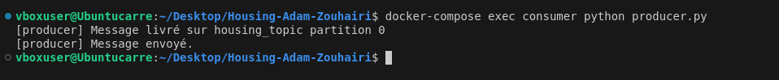

# Housing Project

Ce projet implémente une API FastAPI connectée à PostgreSQL pour stocker des informations sur les logements, un modèle de machine learning pour prédire la valeur médiane d’un logement, et un système de messaging basé sur Kafka permettant de traiter des données en temps réel.

---

## Prérequis

Avant de démarrer, assurez-vous d’avoir installé :

- Docker et Docker Compose
- Python 3.12 (si vous voulez exécuter certains scripts manuellement)
- Un compte Kaggle (si vous souhaitez télécharger les données du modèle)

---

## Démarrage rapide

1. Clonez ce dépôt :

   ```bash
   git clone https://github.com/votre-utilisateur/housing-projet.git
   cd housing-projet
   ```

2. Lancez les services avec Docker Compose :

   ```bash
   docker-compose up --build
   ```

   Cela démarre :

   - PostgreSQL (db)
   - L’API FastAPI (api)
   - Le modèle ML de prédiction (model)
   - Le broker Kafka (broker)
   - Le consumer Kafka (consumer)

---

## Vérifier le bon fonctionnement

### Tester l'API principale

#### Vérifier que l'API est accessible :

```bash
curl http://localhost:8000/houses
```

Si aucun logement n’a encore été ajouté, la réponse sera `[]`.

#### Ajouter une maison (POST /houses)

```bash
curl -X POST -H "Content-Type: application/json" -d '{
  "longitude": -122.23,
  "latitude": 37.88,
  "housing_median_age": 41,
  "total_rooms": 880,
  "total_bedrooms": 129,
  "population": 322,
  "households": 126,
  "median_income": 8.3252,
  "median_house_value": 452600.0,
  "ocean_proximity": "NEAR BAY"
}' http://localhost:8000/houses
```

#### Vérifier que la maison a été bien ajoutée :

```bash
curl http://localhost:8000/houses
```

---

### Tester l’API de prédiction du modèle ML

```bash
curl -X POST -H "Content-Type: application/json" -d '{
  "longitude": -122.23,
  "latitude": 37.88,
  "housing_median_age": 41,
  "total_rooms": 880,
  "total_bedrooms": 129,
  "population": 322,
  "households": 126,
  "median_income": 8.3252
}' http://localhost:8002/predict
```

La réponse ressemblera à :

```json
{
  "predicted_median_house_value": 356700
}
```

---

### Tester Kafka (Consumer & Producer)

#### Envoyer un message avec le producer

Dans un autre terminal, exécutez :

```bash
docker-compose exec consumer python producer.py
```

#### Vérifier que le consumer traite le message

Dans les logs du consumer (`docker-compose logs -f consumer`), vous devriez voir :

```
[consumer] Message consommé et envoyé
```


---

## Développement et débogage

### Voir les logs en temps réel

```bash
docker-compose logs -f
```

Pour un service spécifique (ex. le consumer) :

```bash
docker-compose logs -f consumer
```

### Entrer dans un container en mode interactif

```bash
docker exec -it housing_api /bin/sh
```

### Arrêter tous les services

```bash
docker-compose down
```

Pour tout supprimer (conteneurs, volumes, réseaux) :

```bash
docker-compose down -v
```

---

## Détails des services

| Service  | Description |
|----------|------------|
| db | Base de données PostgreSQL |
| api | API FastAPI pour gérer les maisons |
| model | Service ML pour prédire les prix des logements |
| broker | Kafka pour la communication en temps réel |
| consumer | Consumer Kafka qui récupère et stocke les données |

---

## Problèmes courants et solutions

### Kafka "UNKNOWN_TOPIC_OR_PART"
Si Kafka refuse de reconnaître le topic :

1. Vérifiez que le topic existe :

   ```bash
   docker-compose exec broker kafka-topics.sh --list --bootstrap-server broker:9092
   ```

2. S'il n'existe pas, créez-le :

   ```bash
   docker-compose exec broker kafka-topics.sh --create --topic housing_topic --bootstrap-server broker:9092 --partitions 1 --replication-factor 1
   ```

---

## Licence

Ce projet est sous licence MIT. Vous pouvez le modifier et l’utiliser librement.

---

## Auteurs

- Adam Zouhairi

